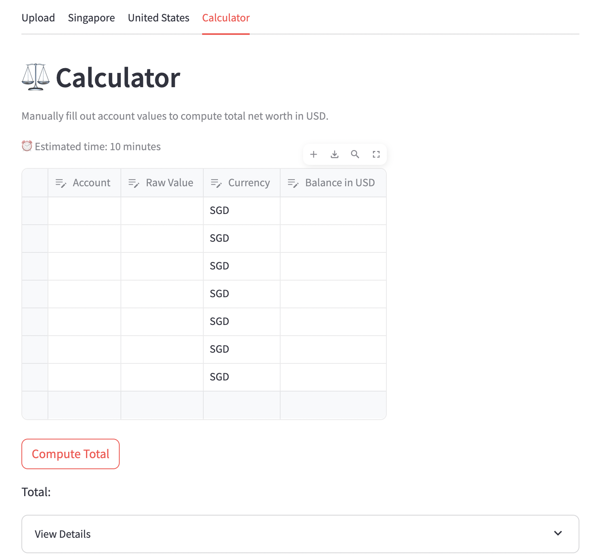

This is a personal finance project that I have been working on in my free time. My goal is to consolidate my expenses and keep track of my account balances over time. This tracker is meant to be used once every month to set short term spending goals and once every quarter to set long term investment goals.

Below are some screenshots of the frontend functions that I have created for my financial goals.

