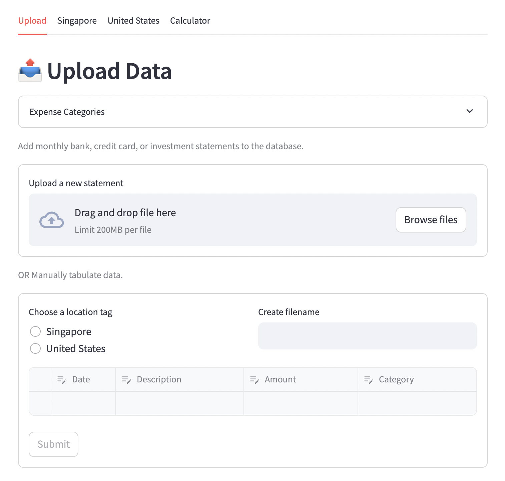
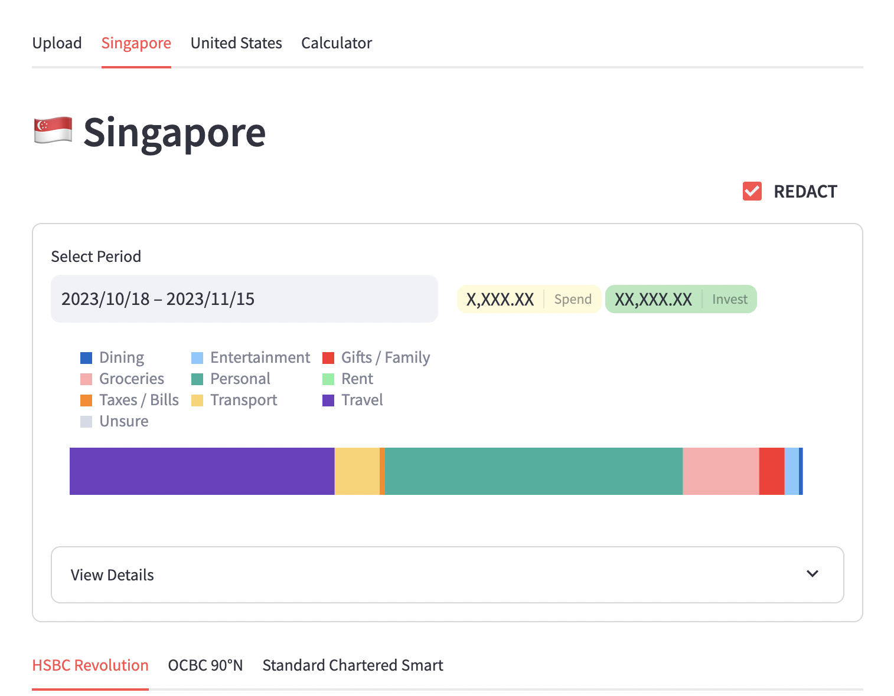
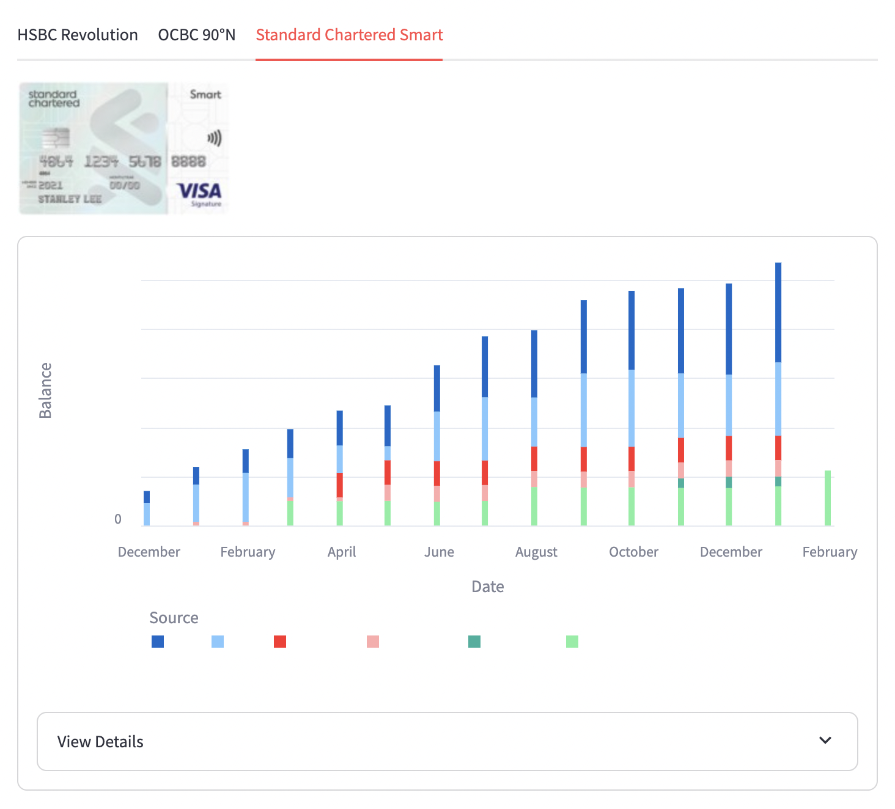
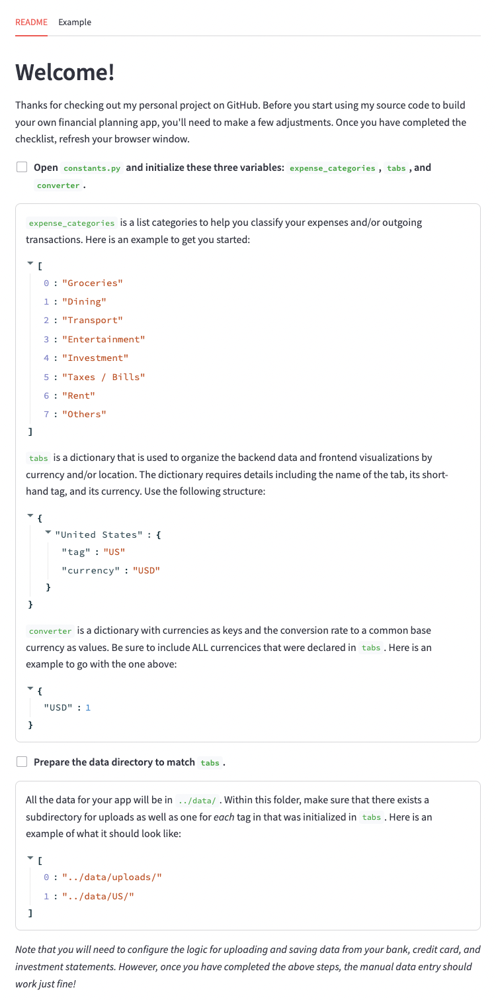

Here are some static screenshots of what the financial app looks like when it is up and running

To get started, follow the steps outlined in the README tab. Once you have completed these steps, refresh the window and the tab should disappear.

